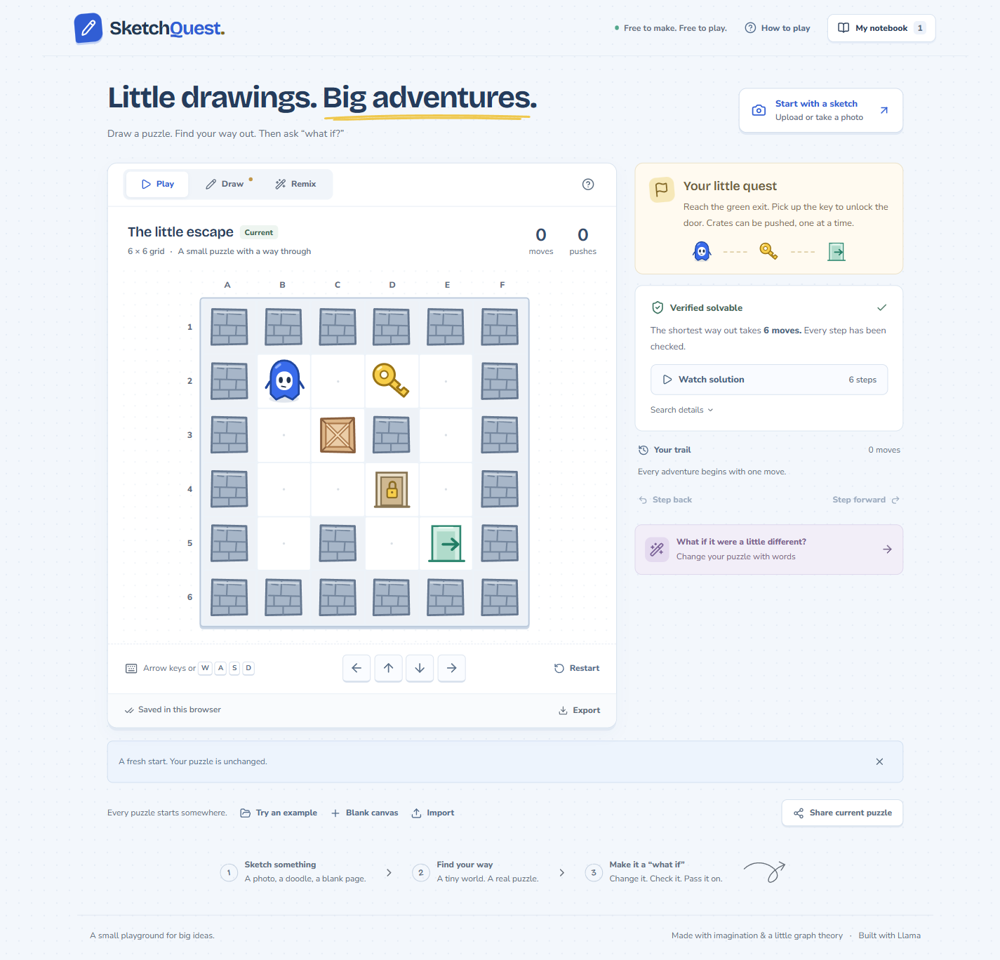
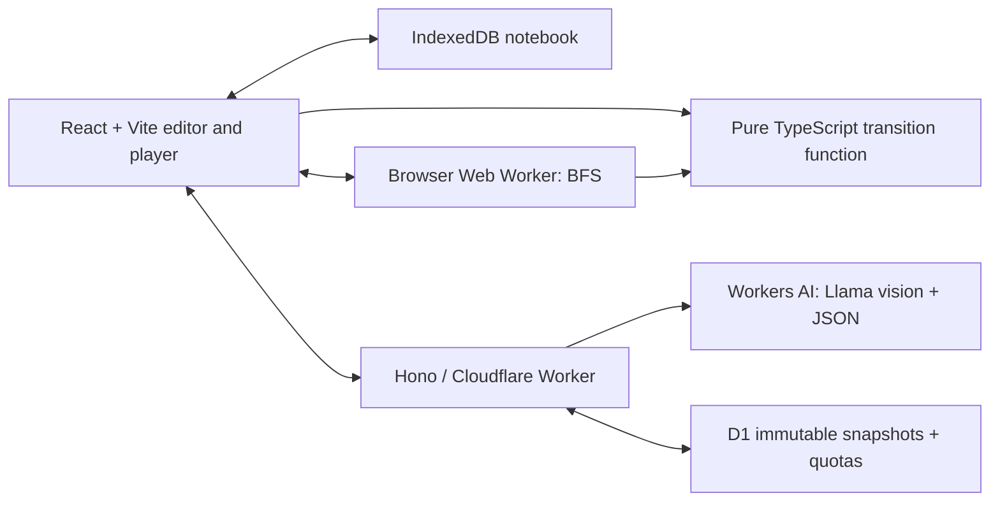

# SketchQuest

**Draw a puzzle. Play it. Change it with words. Check the proof.**

SketchQuest is an original grid-puzzle workbench with a manual editor, a deterministic shortest-path solver, photo interpretation, structured natural-language proposals, and immutable sharing. All deployed services are designed for Cloudflare's **Free** plan. No paid model fallback, payment feature, or prepaid gateway is configured.



The interface was refined using Impeccable and Design with Intent. [Generated page/section reference and implementation evidence](docs/design/verification.md) include desktop and mobile captures, the original generation prompt, and accessibility findings. Verification: 87 unit/integration tests and 19 Chromium browser tests pass; live model evaluation remains unrun.

## Run locally

Requires Node.js 24 and npm. Tested on Windows with Node 24.19.0.

```sh
npm ci
npm run db:migrate
npm run dev
```

Open **http://127.0.0.1:5173**. The local Cloudflare runtime serves both the app and the API. D1 runs locally; photo and text inference are disabled until a confirmed free Cloudflare setup is connected. Manual drawing, play, solving, replay, revision saving, import/export, and local shared links work without model credentials.

Local shared links work on the machine running the app. Public links require deployment.

### Try the complete deterministic demonstration

1. Open **The little escape**, the first example.
2. Its solver verifies a shortest solution of **6 moves**.
3. Open **Remix → Try a prepared change**. This is explicitly labeled a prepared example, not a live AI response.
4. Inspect the changed cell and the solver's **6 → 10 moves** comparison.
5. Accept the proposal, watch the solution, and share the new immutable puzzle.

The comparison and replay are computed live by the real rule engine. This example demonstrates the verification workflow when inference is unavailable; it is not evidence of model quality.

### Portable example puzzles

Download any example JSON and use **Import**, then review and apply it:

- [The little escape](public/examples/little-escape.json) — shortest solution: 6 moves.
- [Under cover](public/examples/key-under-cover.json) — shortest solution: 4 moves, including 2 pushes.
- [Two’s company](public/examples/two-company.json) — shortest solution: 10 moves.

The same files are served at `/examples/<example-id>.json` when the app runs. They contain only a title and canonical board data; no photographs, prompts, or play history.

To create three immutable local share links after starting the app and applying local migrations:

```sh
npx tsx scripts/seed-demo-shares.ts --base-url http://127.0.0.1:5173
```

The script accepts loopback hosts only, makes no model calls, verifies every snapshot by reading it back, and writes `artifacts/demo-links.json`. It creates up to three shares per run and does not retry; avoid running it during sharing-quota tests. Local links require the same running server and retained local D1 data. They are not publicly hosted demo URLs.

## Checks

```sh
npm test
npm run typecheck
npm run build
npm run eval:solver
npm run eval:extraction
```

For browser tests, start `npm run dev` in another terminal after applying local migrations:

```sh
npx playwright install chromium
npm run test:e2e
```

Tests that simulate model responses label them as mocks and never call the real model. The extraction evaluator does not generate missing predictions or treat unavailable metrics as zero.

## Live AI and free deployment

Production has not been provisioned by this checkout. A real account and D1 database are required.

1. Use a dedicated **Workers Free** account. Verify its plan in the Cloudflare dashboard. Do not attach prepaid AI Gateway credits or upgrade the account. An app setting alone cannot prove the account's billing plan.
2. Authenticate Wrangler locally with `npx wrangler login`.
3. Create a new database with `npx wrangler d1 create sketchquest`. Set only this project's returned ID in `wrangler.jsonc`; keep existing projects unchanged.
4. Apply the committed migrations with `npm run db:migrate:remote`.
5. Set a random secret of at least 32 characters with `npx wrangler secret put QUOTA_SECRET`. Never put secrets in client variables or commit them.
6. Complete the Llama model's license setup described in [the official model documentation](https://developers.cloudflare.com/workers-ai/models/llama-3.2-11b-vision-instruct/). Add `"ai": { "binding": "AI" }` to Wrangler configuration and set `FREE_PLAN_CONFIRMED` to `"true"` only after checking the account.
7. Run the production checks, then `npm run deploy`. Wrangler gives the free `workers.dev` URL.
8. Test one owned, non-sensitive drawing and one text edit. Check model availability, schema handling, latency, Worker CPU, and the dashboard's free quota. Live model quality is not established until these runs and the held-out evaluation have happened.

Workers AI currently hard-stops free inference at its daily quota. Local development with a remote AI binding also consumes that quota. Do not enable live inference in CI. The app does not automatically retry rejected output or switch models/providers. See [API setup and safeguards](docs/api.md).

## Architecture



- `src/core` owns board validation, terrain/occupant rules, editing operations, and examples. It has no React, provider, or database dependencies.
- `src/solver` searches complete game states and replays every successful path before verification. The browser rejects responses with stale job/revision/content identities.
- `src/image` prepares photos locally, removes metadata by re-encoding, and requires an explicit interpretation action.
- `src/state` owns versioned local persistence, HTTP calls, and Worker lifecycle management.
- `worker` validates external data, admits requests against durable limits, calls the model, and stores public board snapshots.

The game, solver, history, and replay all use the same pure transition function. Independently authored rule examples and a separate tiny reference solver check that function's behavior.

## Rules and controls

Reach the exit on a 4–8 by 4–8 grid. Move with arrows, WASD, or touch controls. Walls and boundaries block movement. Push one crate into a free traversable cell. Keys unlock doors permanently; crates can cover keys but cannot collect them. A successful push is both one move and one push.

Draw with the symbol palette or shortcuts 1–8; Ctrl/Cmd+Z and Shift+Ctrl/Cmd+Z undo and redo. Accepted changes create new revisions and fresh play sessions. Earlier revisions and parked drafts remain in the notebook. Solution playback is separate from your own play history.

Read [the complete edge-case rules](docs/rules.md), [image input details](docs/image-input.md), [evaluation methodology](docs/evaluation.md), [portfolio case study](docs/case-study.md), and [a real regression that was fixed](docs/failure-case.md).

## Privacy and limitations

Original photos stay in browser memory; only an explicitly submitted, prepared crop reaches the inference provider. Photos, prompts, private revisions, and player histories are excluded from shared snapshots and application logs. The photo preview is deliberately not persisted across reloads. Browser storage is not account synchronization or a guaranteed backup; export boards to keep portable copies.

The photo feature is designed as a review-and-correct workflow; recognition quality on loose sketches has not been established. Uncertain symbols and dimensions are not calibrated accuracy scores. The included evaluation drawings are **synthetic, authored vector sketches**, not human photographs. Real handwriting and live model accuracy remain unmeasured until an independently annotated photo corpus is evaluated.

Free service quotas can pause AI or sharing; local editing, solving, and play remain available. Browser cancellation discards the request, but cannot guarantee that an already dispatched provider inference stops consuming its free quota.

Shortest-move length is a difficulty proxy, not a prediction of human difficulty. BFS does not optimize push count among equally short solutions.

## Credits

The playable interface uses original procedural SVG puzzle graphics and no borrowed game assets. User-requested generated page/section mockups are kept separately as design references in `docs/design`; they are not gameplay assets. Built with Llama; see [third-party notices](THIRD_PARTY_NOTICES.md). Application source is MIT licensed.
